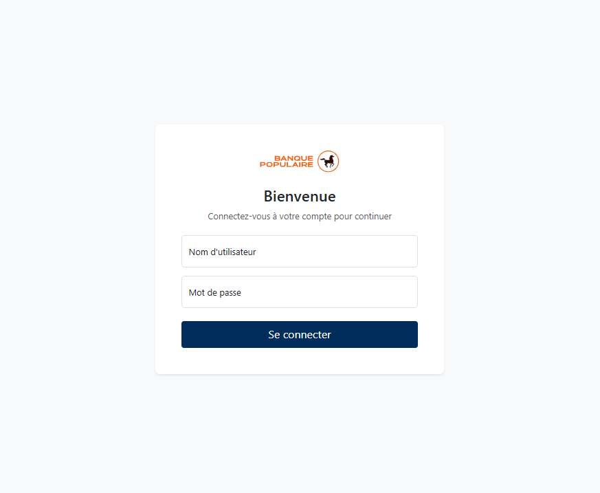
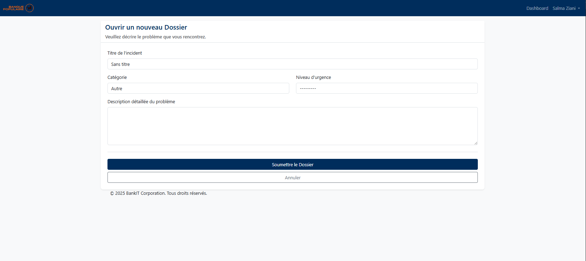
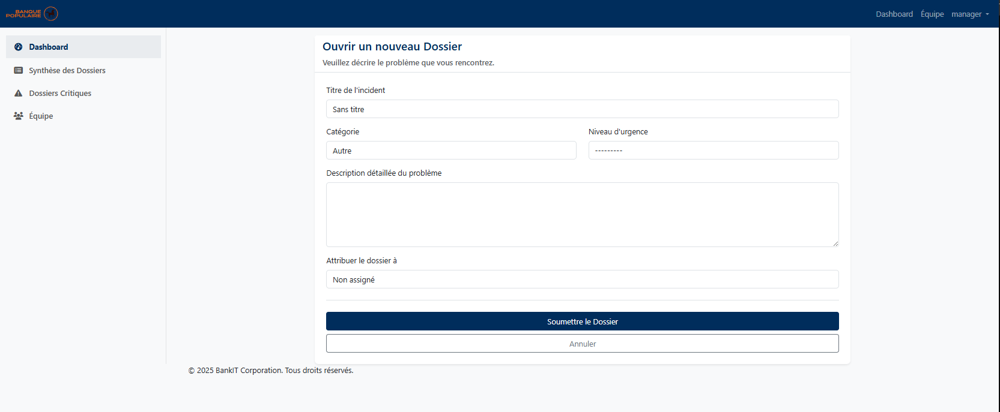
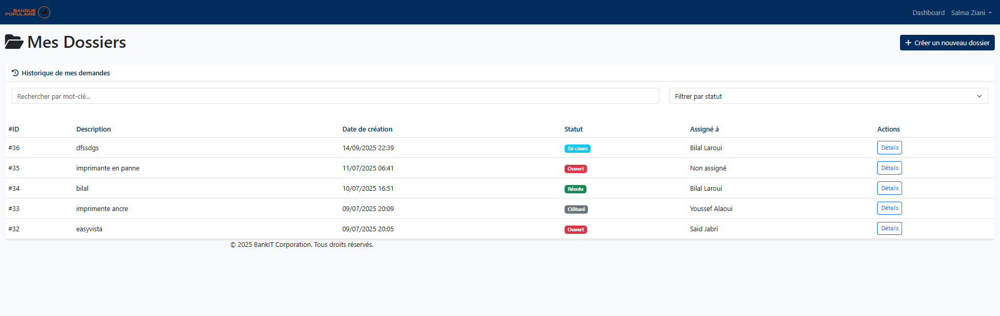
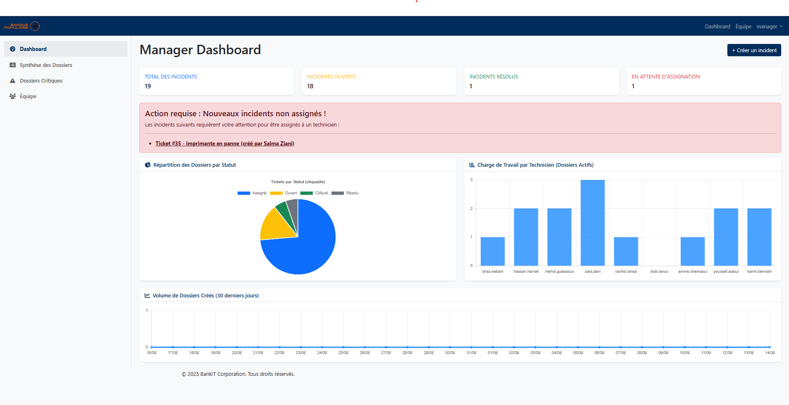
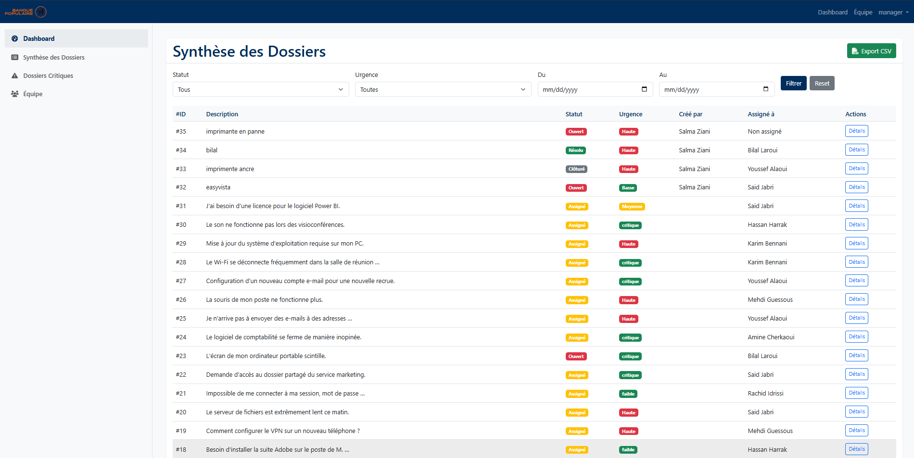
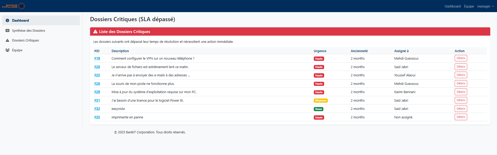
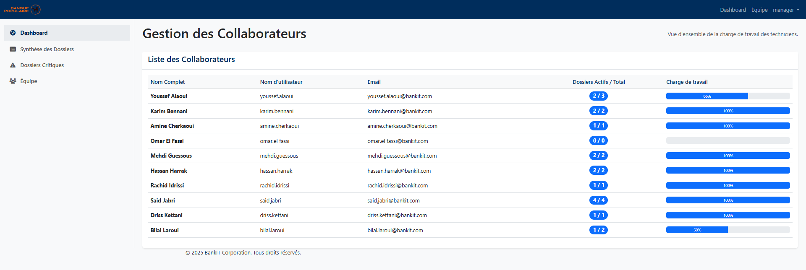
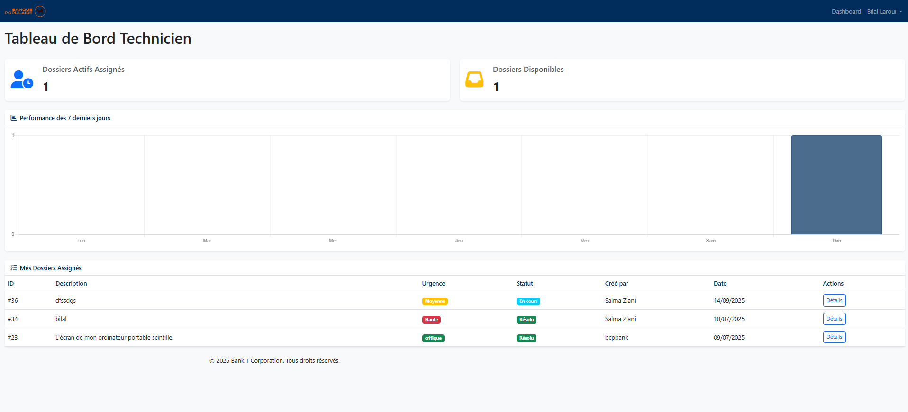
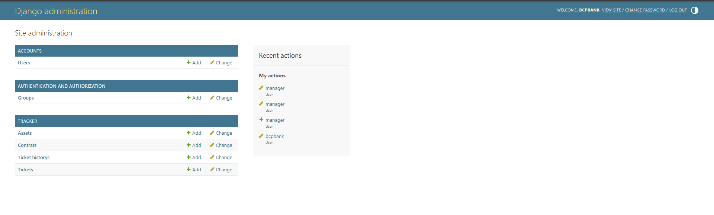

# BankIT-Track

## Présentation
**BankIT-Track** est une application web de **ticketing / suivi des incidents** conçue pour centraliser la création, l’assignation et le traitement des demandes (appelées *dossiers*). 

L’application met à disposition :
- un espace **Employé** pour déclarer et suivre ses demandes,
- un espace **Manager** pour superviser et assigner,
- un espace **Technicien** pour traiter les dossiers,
- un espace **Admin** (Django Admin) pour administrer les entités.

Le rapport du projet est disponible ici : **[BankITpfa.pdf](BankITpfa.pdf)**

---

## Fonctionnalités principales
- Authentification (page de connexion)
- Création d’un dossier / incident
- Suivi des dossiers (historique, recherche)
- Gestion des statuts (ex. Ouvert, En cours, Résolu, Clôturé)
- Dashboards par rôle (Employé, Manager, Technicien, Admin)
- Back-office d’administration via **Django Admin**

---

## Captures d’écran
Les images ci-dessous proviennent du dossier [`Screenshots/`](Screenshots).

### Connexion


### Création d’un dossier / incident



### Dashboards
#### Employé


#### Manager





#### Technicien


#### Admin


---

## Architecture (haut niveau)
- **Backend** : Django (gestion des utilisateurs, logique métier, tickets/dossiers)
- **Admin** : Django Admin (gestion des entités)
- **Frontend** : interface web (dashboards, formulaires, historique)
- **Base de données** : gérée via Django ORM (selon la configuration)

---

## Installation & exécution (à compléter)
> Le dépôt actuel contient principalement le **rapport PDF** et les **captures d’écran**. 
> Si tu ajoutes le code source au dépôt (ou si tu me donnes le lien du repo/branche), je complète cette section avec les commandes exactes.

Exemple typique pour un projet Django :
```bash
# 1) Créer un venv
python -m venv .venv
source .venv/bin/activate  # Linux/macOS
# .venv\Scripts\activate  # Windows

# 2) Installer les dépendances
pip install -r requirements.txt

# 3) Migrations
python manage.py migrate

# 4) Lancer le serveur
python manage.py runserver
```

---

## Auteurs
- @zairi-yassine

---

## Licence
À définir.
